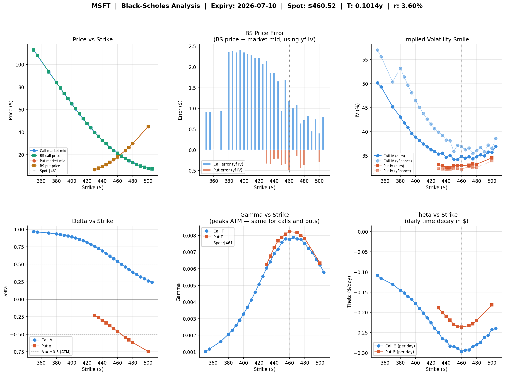
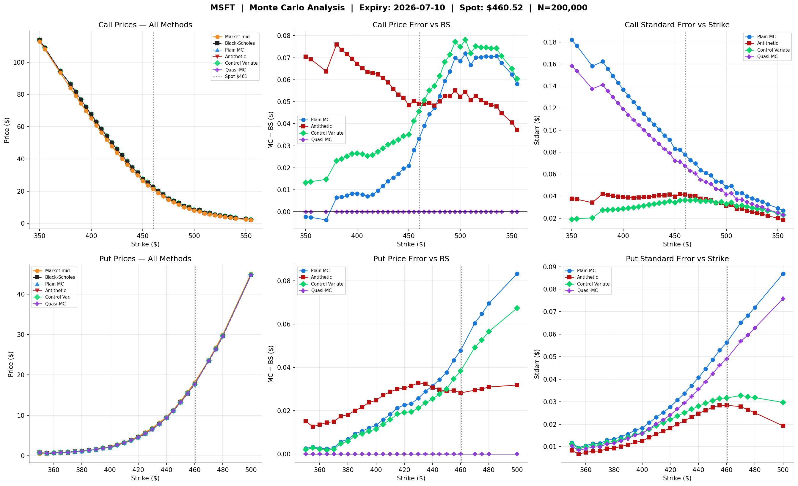
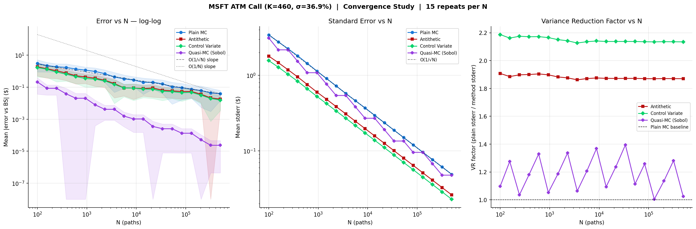

# Quantum-Options-Pricing
Error Analysis and Benchmarking Computational Complexity across Black-Scholes, Monte Carlo and Quantum Amplitude Estimation engines for pricing different types of options

The Black-Scholes model does not account for "early exercise" flexibility which means it is optimal only for European Options. Monte Carlo models simulate thousands of possible future price paths for an underlying asset using random sampling, so they can be used for pricing various types of options. QAE is a quantum computing algorithm that provides a quadratic speedup over classical Monte Carlo simulations for option pricing, so can also be used for pricing various types of options. 

## Background
Call Option: Right to buy an asset at a predetermined price  
Put Option: Right to sell an asset at a predetermined price  

European Option: can only be exercised on the exact expiration date. If an investor wants to exit the trade before expiration, they must sell the option contract on the secondary market rather than exercising it.    (Used in Stock Index Options)

American Option: can be exercised at any time from the purchase date up to and including the expiration date. This flexibility gives the option holder more control, which often makes American options slightly more valuable than their European counterparts. (individual stock)

Asian Option: Same as European Options but the payoff is determined by the average price of the underlying asset over a prespecified period, rather than its final price. (Forex/Commodities)

Barrier Options: payoff depends on whether the underlying asset's price hits a predetermined threshold (the barrier) during the life of the contract. If the barrier is reached, the option is either activated or canceled.    (Forex and Commodities)

T = Time in years until contract can be exercised  
S0 = Price of stock at the moment  
K = Strike Price (Agreed Buy/Sell price)  
ST = Price of stock at time T  
C = Price of Call Option  

Long Call Payoff = max(ST-K,0)  
Long Call Profit = max(ST-K,0)-C  
BreakEven = K+C  
Long Put Payoff = max(K-ST,0)  

## Black Scholes Engine
Used for pricing European options, computing Greeks, and analysing implied volatility from live market snapshots.

BlackScholes.ipynb loads saved options market data runs the BS engine across every liquid strike with two passes:
Pass 1: re-prices using yfinance IV and shows where BS misprices the market
Pass 2: backs out IV via Newton-Raphson and produces Greeks at the true market-implied vol

It then produces visuals analysing price vs strike, price error, IV smile, delta, gamma, theta and uses ATM implied volatility to predict stock price at expiriy and probability of a gain at expiriy.

### BlackScholes Analysis

Price Vs Strike: BlackScholes and market mid track both track each other closesly for puts and calls. This means BlackScholes is a reasonable model for pricing MSFT at the current expiry. 

BS Price Error: Calls show error of $0.5 - $2.40, all positive (i.e BS overpirces calls vs market). Puts show small negative errors near ATM.

IV Smile: Shows a volatility skew instead of a flat smile. Deep OTM calls carry IV of 50-55% whereas ATM is at 30-35%. This indicates a put skew where market is pricing downside protection expensively. This is leading to large calls errors at low strikes. 

The IV-skew causes systematic overpricing of deep ITM calls by upto $2.40 which is a known BlackScholes limitation.

### BlackScholes Implied Terminal Price

The market expects MSFT to be trading in the range of $383-$550 range by 2026-07-10 with 90% confidence. This range suggests elevated uncertainity is priced in. The estimated stock price at expiry is $462.60 

## Monte Carlo Engine
Run 4 MonteCarlo methods and compares results with BlackScholes "true answer". 

Every MC method gives the PriceEstimate, StdErr(Uncertainity in estimate), |Error|(actual distance from BS truth), CI_Width(95% confidence interval) and Time taken to run the simulation. 

Plain Monte Carlo - Baseline  
Antithetic MC - For every random path Z, it also runs -Z(mirror path). This halves the stderr and nearly halves CI width.  
Control Variate MC - uses known expectation of S_T as correction anchor. More statistically sophisticated.  
Quasi MC - instead of random numbers it uses a deterministic low-discrepancy sequence that fills the probability space more evenly. QuasiMC is the winner for Option pricing. 

## Monte Carlo Analysis

Price Erorr vs Black Scholes:  
    QuasiMC - flat at $0.00 error across the entire strike range (essentially replicating BS analytically).  
    PlainMC and AntitheticMC - show errors peaking around ATM where gamma is highest.  
    High gamma = High path sensitivity = noisier MC estimates  
    Control Variate MC is better than PlainMC but cant match QuasiMC

Standard Error vs Strike: plain MC has highest stderr ($0.18) at low strikes for calls shrinking as strikes rise (OTM options have smaller payoffs so less variance). Antithetic and Control Variate MC halve it. QuasiMC id inconsistently noisy in stderr terms (**stderr is a misleading metric for QuasiMC since it is not truly random**).

## Monte Carlo Convergence Study

Error vs N(log-log):  
    PlainMC, Antithetic and Control Variate all follow the O(1/√N) slope -> error halves each time you quadruple paths.  
    QuasiMC diverges completely -> follows roughly O(1/N) or better at high N, converging faster.  
        By N = 200,000 at ~10^-5 error while others are at ~10^-1.

Standard Error vs N:  
    All methods reduce stderr predictably with N. Control variate consistently sits lowest among the random methods. 

Variance Reduction Factor:  
    Control Variate gives a stable ~2.2x reduction regardless of N (It is reliable and predictable)  
    Antithetic gives a stable ~1.9x (slightly less but still consistent)  
    QuasiMC oscilates wildly (1.0x - 1.4x). VRF is not a meaningful metric for Sobol Sequences. Its advantage is in actual error, not variance. 

## Quantum Amplitude Estimation (QAE)
Encodes the entire stock price distribution into a quantum state and uses quantum amplitude amplification to extract the expected payoff with quadratically fewer "oracle calls" than MonteCarlo needs paths. It uses Grover-like amplitude amplification to extract E[payoff] directly, without sampling each path individually. Where MC needs N^2 paths to halve error, QAE needs only N oracle calls.

Classical QAE: Uses Quantum Phase Extension(QPE) with m evaluation qubits. This is used as the theoretical baseline only because circuit depth grows as 2^m, which makes it impractical on current NISQ hardware as it cannot sustain coherence over deep circuits.  

Iterative QAE: Replaced deep QPE circuit with an adaptive loop which achieves O(1/ε) oracle complexity with shallow circuits. This makes IQAE a practical engine for near term quantum hardware (NISQ friendly).

Maximum Likelihood QAE: Uses fixed schedule of Grover depths [1,3,5,9,17,33,65]. Runs all circuits in parallel, collects shot counts and finds amplitude maximising join log-likelihood. It is simpler than IQAE, parallelisable and statistically cleaner. 

Noise Model: Real quantum hardware introduces depolarising noise per gate. Each oracle call degrades amplitude with decay factor (1-2p)^M. The noise impact study identifies the crossover point beyond which MonteCarlo outperforms QAE (typically around noise_p ~ 10^-3 to 10^-4 per gate).